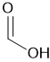
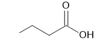

# Chapter 3 - Chemical Compounds

*Textbook: Petrucci, General Chemistry, 11th Edition*

---

## Notes:

### Example 3-5

> **Goal: Find molecular formula of dibutyl succinate from % mass composition and molecular mass**
>
> Given:
> 
> $`62.58\%`$ - Carbon
>
> $`9.63\%`$ - Hydrogen
>
> $`27.79\%`$ - Oxygen
>
> C - $`12.011\ \frac{\text{g}}{\text{mol}}`$
>
> H - $`1.008\ \frac{\text{g}}{\text{mol}}`$
>
> O - $`15.999\ \frac{\text{g}}{\text{mol}}`$
>
> dibutyl succinate - $`230\ \frac{\text{g}}{\text{mol}}`$
>
>
> Solution:
>
> Assume 100 grams of dibutyl succinate to simplify percent to grams calculations
>
> $`62.58\ \text{g C} \cdot \frac{1\ \text{mol C}}{12.011\ \text{g C}} \approx 5.21\ \text{mol C}`$
>
> $`9.55\ \text{g H} \cdot \frac{1\ \text{mol H}}{1.008\ \text{g H}} \approx 9.55\ \text{mol H}`$
>
> $`27.79\ \text{g O} \cdot \frac{1\ \text{mol O}}{15.999\ \text{g O}} \approx 1.74\ \text{mol O}`$
>
> Normalize (devide by smallest)
>
> $`5.21\ \text{mol C} / 1.74 \approx 3\ \text{mol C}`$
>
> $`9.55\ \text{mol H} / 1.74 \approx 5.5\ \text{mol H}`$
>
> $`1.74\ \text{mol O} / 1.74 = 1\ \text{mol O}`$
>
> Round or Multiply to nearest whole number
>
> $`3\ \text{mol C} \cdot 2 = 6\ \text{mol C}`$
>
> $`5.5\ \text{mol H} \cdot 2 = 11\ \text{mol H}`$
>
> $`1\ \text{mol O} \cdot 2 = 2\ \text{mol O}`$
> 
> | Emperical Formula | Emperical Formula Mass |
> | :---: | :---: |
> | $`\text{C}_{6}\text{H}_{11}\text{O}_{2}`$ | $`115.15\ \frac{\text{g}}{\text{mol}}`$ |
>
> Find Molecular Formula
>
> $`\frac{\text{measured mass}}{\text{emperical formula mass}} = \frac{230}{115.15} \approx 2`$
>
> The molecular formula for dibutyl succinate is $`\text{C}_{12}\text{H}_{22}\text{O}_{4}`$

 

### Combustion Analysis

Is used to determine the emperical formula for compounds with carbon, hydrogen, and oxygen, as well as a few other elements.

| Before | After |
| :---: | :---: |
| $`\text{C}_{x}\text{H}_{y}\text{O}_{z}`$ | $`x\text{C}\text{O}_{2}`$ |
| $`\text{O}_{2}`$ | $`\frac{y}{2}\text{H}_{2}\text{O}`$ |

Once you have the amount of carbon and hydrogen you can figure out the amount of oxygen in the compound, since the oxygen makes up the rest of the original sample mass.

#### Example 3-6

> **Goal: Find the emperical formula**
>
> Given:
>
> Sample - $`0.2000\ \text{g}`$
>
> after combustion
>
> $`\text{CO}_{2}`$ - $`0.2998\ \text{g}`$
>
> $`\text{H}_{2}\text{O}`$ - $`0.0819\ \text{g}`$
>
> | Element/Compound | Molar Mass |
> | :---: | :---: |
> | C | $`12.011\ \frac{\text{g}}{\text{mol}}`$ |
> | O | $`15.999\ \frac{\text{g}}{\text{mol}}`$ |
> | H | $`1.008\ \frac{\text{g}}{\text{mol}}`$ |
> | $`\text{H}_{2}\text{O}`$ | $`18.015\ \frac{\text{g}}{\text{mol}}`$ |
> | $`\text{CO}_{2}`$ | $`44.009\ \frac{\text{g}}{\text{mol}}`$ |
>
> Solution:
> 
> Grams of $`\text{CO}_{2}`$ to moles and grams of carbon
> 
> $`0.2998\ \text{g CO}_{2} \cdot \frac{1\ \text{mol CO}_{2}}{44.009\ \text{g CO}_{2}} \cdot \frac{1\ \text{mol C}}{1\ \text{mol CO}_{2}} \approx 6.812 \times 10^{-3}\ \text{mol C}`$
>
> $`6.812 \times 10^{-3}\ \text{mol C} \cdot \frac{12.011\ \text{g C}}{1\ \text{mol C}} \approx 0.08182\ \text{g C}`$
>
> Grams of $`\text{H}_{2}\text{O}`$ to moles and grams of hydrogen
>
> $`0.0819\ \text{g H}_{2}\text{O} \cdot \frac{1\ \text{mol H}_{2}\text{O}}{18.015\ \text{g H}_{2}\text{O}} \cdot \frac{2\ \text{mol H}}{1\ \text{mol H}_{2}\text{O}} \approx 9.092 \times 10^{-3}\ \text{mol H}`$
>
> $`9.092 \times 10^{-3}\ \text{mol H} \cdot \frac{1.008\ \text{g H}}{1\ \text{mol H}} \approx 0.009165\ \text{g H}`$
>
> Calculate oxygen
>
> $`\text{sample mass} - \text{C mass} - \text{H mass} \approx \text{O mass}`$
>
> $`0.2000-0.08182-0.009165 \approx 0.1090\ \text{g O}`$
>
> $`0.1090\ \text{g O} \cdot \frac{1\ \text{mol O}}{15.999\ \text{g O}} \approx 6.814 \times 10^{-3}\ \text{mol O}`$
>
> Empirical formula
>
> $`\text{C}_{\frac{6.812}{6.812}}\text{O}_{\frac{6.814}{6.812}}\text{H}_{\frac{9.092}{6.812}} \approx \text{COH}_{1.3347}`$
>
> $`\text{COH}_{1.3347} \times 3 \approx \text{C}_{3}\text{O}_{3}\text{H}_{4}`$
>
> The empirical formula for the sample is $`\text{C}_{3}\text{O}_{3}\text{H}_{4}`$

 

### Oxidation State

The oxidation state of a atom within a compound is how many electrons the atom gains, loses, or uses in a reaction.

Rules for oxidation state: 

1. Uncombined elements have oxidation state equal to zero
2. The sum of all oxidation states is equal to the compound overall oxidation state (zero for a nutrial compound, the charge for an ion)
3. Group one metals have $`+1`$ oxidation state in compounds, group two metals have $`+2`$ oxidation state in compounds
4. Fluorine has $`-1`$ oxidation state in compounds
5. Hydrogen has $`+1`$ oxidation state in compounds
6. Oxygen has $`-2`$ oxidation state in compounds
7. In binary compounds halogens have $`-1`$ oxidation state, group sixteen has $`-2`$ oxidation state, and group 15 has $`-3`$ oxidation state

In some cases compounds need to be repersented in a more explicit form to get corect oxidation state, rather then to get an average oxidation state.

Examples of more explicit chemical structure:

| Molecular Formula | Oxidation State | Explicit structure | Oxidation State |
| :---: | :---: | :---: | :---: |
| $`\text{Fe}_{3}\text{O}_{4}`$ | $`\text{Fe}=+2\frac{2}{3}`$ | $`\text{FeO}\cdot\text{Fe}_{2}\text{O}_{3}`$ | $`\text{Fe}=+2\ \text{Fe}_{2}=+3`$ |
| $`\text{NH}_{4}\text{NO}_{3}`$ | $`\text{N}=+1`$ | $`\text{NH}_{4}^{+}\cdot\text{NO}_{3}^{-}`$ | $`\text{N}^{+}=+3\ \text{N}^{-}=+5`$ |

 

### Naming Organic and Inorganic Compounds

#### Inorganic Compounds

Binary compounds (metal/nonmetal):

Name - metal nonmetal-ide

Example - NaCl is Sodium Chlor<ins>ide</ins>

Sometime metals form multiple common ions. These can be distinguished using the oxidation number as a roman numeral in parentheses after the metal.

Example - 

$`\text{FeCl}_{2}`$ is Iron (II) Chloride

$`\text{FeCl}_{3}`$ is Iron (III) Chloride

 

Binary compounds (nonmetal/nonmetal):

Name - positive oxidation state negative oxidation state-ide

Example - HCl is Hydrogen Chloride

Some nonmetal/nonmetal binary compounds form multiple different compounds. You should use prefixes to distinguish between them.

Example -

NO is Nitrogen <ins>Mon</ins>ox<ins>ide</ins>

$`\text{N}_{2}\text{O}`$ is <ins>Di</ins>nitrogen <ins>Mon</ins>ox<ins>ide</ins>

$`\text{N}_{2}\text{O}_{5}`$ is <ins>Di</ins>nitrogen <ins>Pent</ins>ox<ins>ide</ins>

 

Binary acids:

Name - Hydro-anion-ic acid

Example - 

HBr(aq) is <ins>Hydro</ins>brom<ins>ic</ins> acid

$`\text{H}_{2}\text{S(aq)}`$ is <ins>Hydro</ins>sulfur<ins>ic</ins> acid

 

Polyatomic inos:

$`\text{OH}^{-}`$ (hydrox<ins>ide</ins> ion) and $`\text{CN}^{-}`$ (cyan<ins>ide</ins> ion) have the ide suffix

Oxyanions have oxyeng and a nonmetal

Name - 

lowest nonmetal oxidation state - hypo-nonmetal-ite ion

second lowest nonmetal oxidation state - nonmetal-ite ion

second highest nonmetal oxidation state - nonmetal-ate ion

hightest nonmetal oxidation state - per-nonmetal-ate ion

Thio prefix replace one of the oxygen atoms for a sulfer atom

 

Oxyacids:

Structure of molecule - `H-O-nonmetal`

Name - similar to oxyanions, use different suffixes, and add acid to the end

| oxyaion suffix | oxyacid suffix |
|:---: | :---: |
| -ite | -ous |
| -ate | -ic |

Example - 

$`\text{HClO}`$ is hypochlor<ins>ous</ins> acid

$`\text{HClO}_{3}`$ is chlor<ins>ic</ins> acid

 

Oxosalts:

Structure of molecule - `metal-O-nonmetal`

Name - metal oxyanion

Example - 

$`\text{Na}_{2}\text{SO}_{4}`$ is sodium sulfate

 

Hydrate:

Water is incorperated in the structure of the compound.

Name - compound name numaric prefix-hydrate

Example - 

$`\text{CoCl}_{2}\cdot6\text{H}_{2}\text{O}`$ is cobalt (II) chloride <ins>hexahydrate</ins>

 

#### Organic Compounds

***More information will be given when reviewing chapter 26***

Alkanes:

Hydrocarbon containing only single bonds.

Name - numaric root-ane

Exaple - 

| Molecular Formula | Name |
| :---: | :---: |
| $`\text{CH}_{4}`$ | methane |
| $`\text{C}_{2}\text{H}_{6}`$ | ethane |
| $`\text{C}_{3}\text{H}_{8}`$ | propane |
| $`\text{C}_{4}\text{H}_{10}`$ | butane |
| $`\text{C}_{5}\text{H}_{12}`$ | pentane |

 

Alkenes:

Hydrocarbons containing at least one double bond.

Name - numaric root-location of double bond-ene

Example - 

|Molecular Formula | Name |
| :---: | :---: |
| $`\text{C}_{2}\text{H}_{4}`$ | ethene |
| $`\text{C}_{3}\text{H}_{6}`$ | propene |
| $`\text{H}_{2}\text{C}=\text{CCCH}_{3}`$ | but-1-ene |
| $`\text{H}_{3}\text{CC}=\text{CCH}_{3}`$ | but-2-ene |

 

Alcohols and Hydroxyl Group:

Functional Group Structure - -OH

Name - numaric root-ol

Example - 

| Molecular Formula | Name |
| :---: | :---: |
| $`\text{HOCH}_{3}`$ | methanol |
| $`\text{HOCC}\text{H}_{3}`$ | ethanol |

 

Carboxylic Acid Group:

Functional Group Structure - 

Name - numaric root-oic acid

Example - 

 is butan<ins>oic</ins> acid
